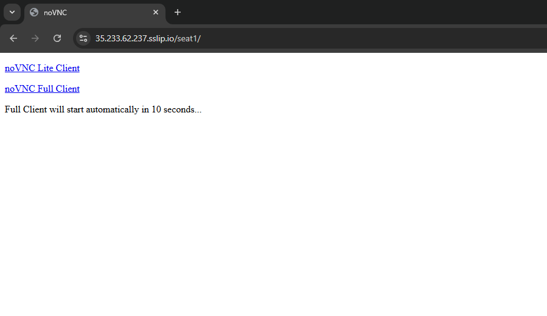
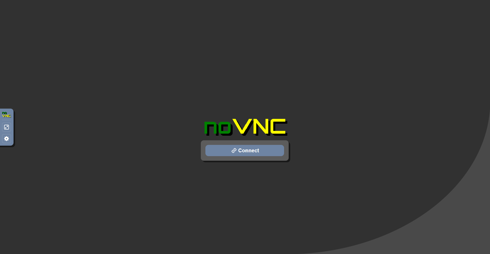
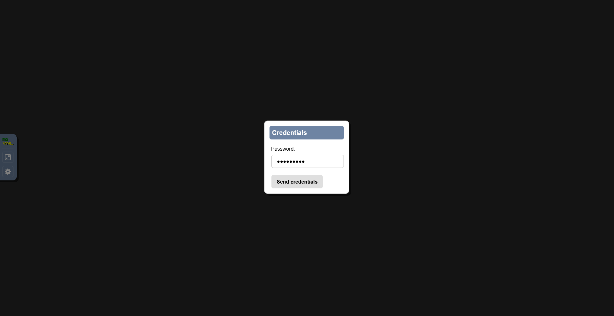
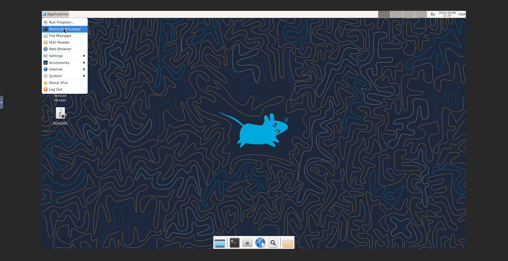
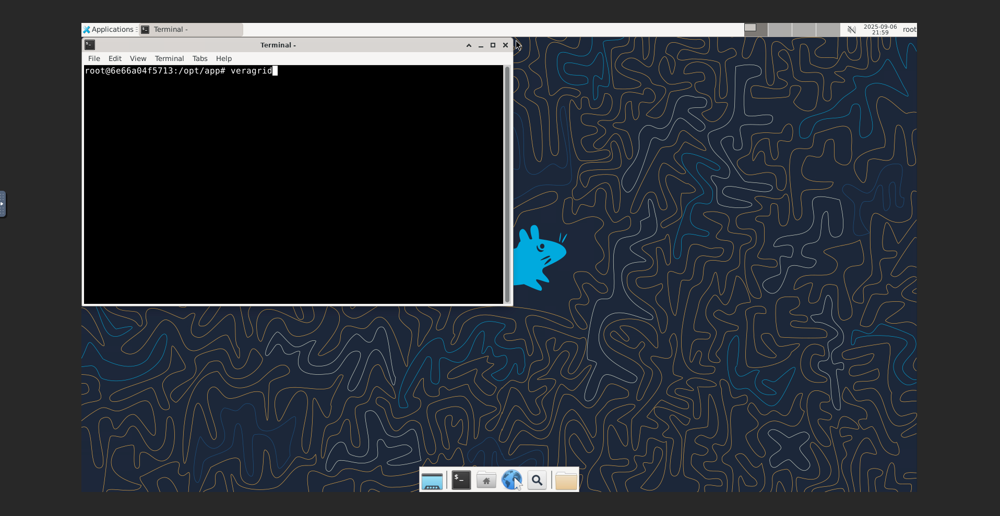

# ACDC power flow & ACOPF tutorial

In this tutorial we will learn how to use VeraGrid for AC power flow and AC optimal power flow (ACOPF) studies:

- [AC/DC Power Flow](./acdc_power_flow.md)
- [AC Optimal Power Flow (ACOPF)](./acopf_tutorial.md)

Complete documentation: [here](https://veragrid.readthedocs.io/en/latest/)

---

## How to Run VeraGrid

### Option A — Run VeraGrid on *your machine*

**Requirements**

* [Download Python](https://www.python.org/downloads/) 3.10-3.13 (3.12 recomended)
* Alternativelly, get a python distribution + all packages installed from [eroots.tech/software](https://www.eroots.tech/veragrid-download)

**Software installation**

```shell
pip3 install veragrid
```

**Execution with user interface**

From the terminal run `veragrid` to launch the graphical user interface.

For scripting, run as you normally would.

To launch the user interface from a script:

```python
from VeraGrid.ExecuteVeraGrid import runVeraGrid

runVeraGrid()
```

or in a single line

```bash
python3`` -c "from VeraGrid.ExecuteVeraGrid import runVeraGrid;runVeraGrid()"
```

---

### Option B — Run VeraGrid in your *browser* (no installs)

On the workshop day we’ll provide:

* a link like `https://35.233.62.237.sslip.io/seat1/`
* a per-seat password `seat1pass`

**Steps**
1. Open the link we provide (e.g., `https://<WORKSHOP URL>/seatX/`) in Chrome/Firefox and click `noVNC Full Client`

2. Open the link we provide (e.g., `https://<WORKSHOP URL>/seatX/`) in Chrome/Firefox.

3. Enter the password we provide on the day.

4. You’ll see a Linux desktop in your browser. Open a terminal

   * Menu → **Applications → Terminal Emulator** (or right-click desktop → **Open Terminal**).
   
5. Launch the GUI:

   ```bash
   veragrid
   ```
6. That’s it—VeraGrid will start inside the browser desktop. You can also run your Python scripts as usual from this terminal.

**Notes**

* We’ll share your exact seat link and password at the start of the session.
* If the browser page looks idle/blank, refresh the page and re-enter the password.
* All you need is a modern browser; no local Python install required.
