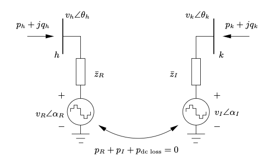
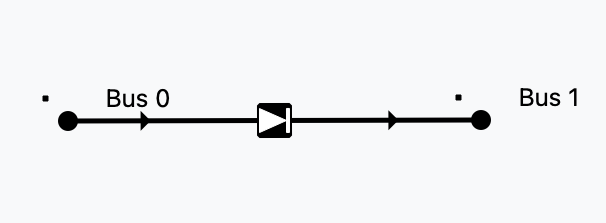
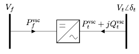
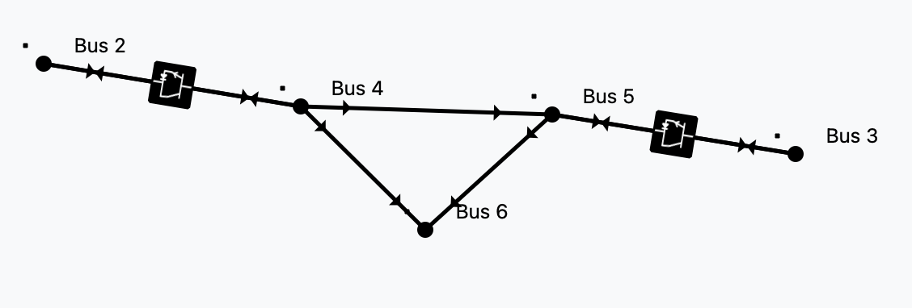
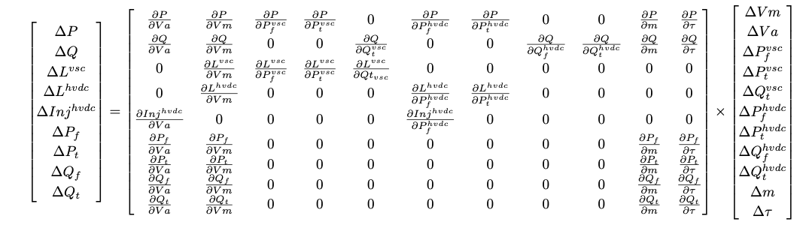

# AC DC power flow tutorial

In this tutorial we are going to discuss the AC-DC power flow implementation
in VeraGrid

## Modelling AC-DC links (the easy way)

The easy way of modelling HVDC links is by using the 2-generator model.
In VeraGrid this is represented by the `HvdcLine`device.



This is a well known model in the literature, however you cannot represent a
proper DC grid with it, nor you can simulate contingencies on the DC elements 
or have more than one cable at a time.



### Controls available

The `HvdcLine` device has only 2 controls: Active power control (`Pset`) and AC line emulation (`free`)

| Control type | Effect                                                  |
|--------------|---------------------------------------------------------|
| Pset         | Set active power                                        |
| free         | AC emulation:<br/>$P = P_0 + k · (\theta_f - \theta_t)$ |

Let's see a python example using 4 buses:

```python
import VeraGridEngine as vg

# Grid instantiation
grid = vg.MultiCircuit()

# Define buses
bus1 = grid.add_bus(vg.Bus(name='B1', Vnom=135, is_slack=True))
bus2 = grid.add_bus(vg.Bus(name='B2', Vnom=135))
bus5 = grid.add_bus(vg.Bus(name='B5', Vnom=135))
bus6 = grid.add_bus(vg.Bus(name='B6', Vnom=135))

# Define AC lines
line12 = grid.add_line(vg.Line(name='L12', bus_from=bus1, bus_to=bus2, r=0.001, x=0.01))
line25 = grid.add_line(vg.Line(name='L25', bus_from=bus2, bus_to=bus5, r=0.05, x=0.05))
line56 = grid.add_line(vg.Line(name='L56', bus_from=bus5, bus_to=bus6, r=0.001, x=0.01))
line256 = grid.add_line(vg.Line(name='L562', bus_from=bus5, bus_to=bus6, r=0.001, x=0.01))

# Define Hvdc Line
line34 = grid.add_hvdc(vg.HvdcLine(name='L34', bus_from=bus2, bus_to=bus5, Pset=0.2))

# Define generators
grid.add_generator(bus=bus1, api_obj=vg.Generator(name='Gen1', P=1.0, vset=1.01))
grid.add_generator(bus=bus6, api_obj=vg.Generator(name='Gen2', P=1.0, vset=1.02))

# Define loads
grid.add_load(bus=bus2, api_obj=vg.Load(name='Load1', P=3.0, Q=0.3))
grid.add_load(bus=bus5, api_obj=vg.Load(name='Load2', P=2.0, Q=0.5))

# Run power flow
pf_options = vg.PowerFlowOptions(solver_type=vg.SolverType.PowellDogLeg,
                                 retry_with_other_methods=False)
pf_driver = vg.PowerFlowDriver(grid=grid, options=pf_options)
pf_driver.run()

print('Bus values')
print(pf_driver.results.get_bus_df())

print('Branch values')
print(pf_driver.results.get_branch_df())

print("error:", pf_driver.results.error)

vg.save_file(grid, "6bus_a.veragrid")
```

## Modelling AC-DC links (the better way)

A better way of simulating AC-DC grids is what led us to research the literature
for formulations that were complete, correct and explicit. Founding none, we
started to create a formulation, by means of introducing how a converter device should behave. 



It turns out that a converter cannot be a regular $\pi$-branch. 
It has to be a _decoupled_ branch represented by two injections.
More or less like the 2-generators model: 2 injections plus a coupling equation.



By introducing this type of branch, we get the freedom to represent the 
AC and DC grids in any level of detail.

### Controls available

An AC branch has 4 unknowns ($Vm_f, Vm_t, \theta_f, \theta_t$) and 4 equations ($P_f, P_t, Q_f, Q_t$).

A DC branch has 2 unknowns ($Vm_f, Vm_t$) and 2 equations ($P_f, P_t$).

A converter branch has 3 unknowns ($Vm_f, Vm_t, \theta_t$) and only 1 _natural_ equation, the losses equation.
That is why every converter must control two magnitudes to add the 2 extra equations needed. 

For every converter we choose 2 controls:

| Control type  | Effect                                             |
|---------------|----------------------------------------------------|
| $Vm_{dc}$     | Voltage module control at the DC side (from side)  |
| $Vm_{ac}$     | Voltage module control at the AC side (to side)    |
| $\theta_{ac}$ | Voltage angle control at the AC side (to side)     |
| $P_{ac}$      | Active power control at the AC side (to side)      |
| $Q_{ac}$      | Reactive power control at the AC side (to side)    |
| $P_{dc}$      | Active power control at the DC side (from side)    |

We must also know that for every DC sub-grid there must be a $Vm$ set point. 
This can be thought of as a DC slack.

Since we must ensure equal number of unknowns and equations globally, 
there is a control compatibility theory that states the following rules:


## Putting all together

We wanted a no-compromise AC-DC power flow with good convergence properties.



This method was introduced in [here](https://upcommons.upc.edu/server/api/core/bitstreams/c522ad67-438a-48c3-aa1b-a03859cd6659/content)
and further developed in VeraGrid from 2024 to 2025.

## 6-bus example

```python
import VeraGridEngine as vg

# Grid instantiation
grid = vg.MultiCircuit()

# Define buses
bus1 = grid.add_bus(vg.Bus(name='B1', Vnom=135, is_slack=True))
bus2 = grid.add_bus(vg.Bus(name='B2', Vnom=135))
bus3 = grid.add_bus(vg.Bus(name='B3', Vnom=100, is_dc=True))
bus4 = grid.add_bus(vg.Bus(name='B4', Vnom=100, is_dc=True))
bus5 = grid.add_bus(vg.Bus(name='B5', Vnom=135))
bus6 = grid.add_bus(vg.Bus(name='B6', Vnom=135))

# Define AC lines
line12 = grid.add_line(vg.Line(name='L12', bus_from=bus1, bus_to=bus2, r=0.001, x=0.1))
line25 = grid.add_line(vg.Line(name='L25', bus_from=bus2, bus_to=bus5, r=1.05, x=0.5))
line56 = grid.add_line(vg.Line(name='L56', bus_from=bus5, bus_to=bus6, r=0.001, x=0.1))
line256 = grid.add_line(vg.Line(name='L562', bus_from=bus5, bus_to=bus6, r=0.001, x=0.1))

# Define DC lines
line34 = grid.add_dc_line(vg.DcLine(name='L34', bus_from=bus3, bus_to=bus4, r=2.05))

# Define VSCs
vsc1 = grid.add_vsc(vg.VSC(name='VSC1', bus_from=bus3, bus_to=bus2, 
                           rate=100, alpha1=0.001, alpha2=0.015, alpha3=0.01,
                           control1=vg.ConverterControlType.Vm_ac, 
                           control2=vg.ConverterControlType.Pdc,
                           control1_val=1.0333, 
                           control2_val=0.2))

vsc2 = grid.add_vsc(vg.VSC(name='VSC2', bus_from=bus4, bus_to=bus5, 
                           rate=100, alpha1=0.001, alpha2=0.015, alpha3=0.01,
                           control1=vg.ConverterControlType.Vm_dc, 
                           control2=vg.ConverterControlType.Qac,
                           control1_val=1.05, 
                           control2_val=-7.21))

# Define generators
grid.add_generator(bus=bus1, api_obj=vg.Generator(name='Gen1', P=1.0, vset=1.01))
grid.add_generator(bus=bus6, api_obj=vg.Generator(name='Gen2', P=1.0, vset=1.02))

# Define loads
grid.add_load(bus=bus2, api_obj=vg.Load(name='Load1', P=3.0, Q=0.3))
grid.add_load(bus=bus5, api_obj=vg.Load(name='Load2', P=2.0, Q=0.5))

# Run power flow
pf_options = vg.PowerFlowOptions(solver_type=vg.SolverType.PowellDogLeg,
                                 retry_with_other_methods=False)
pf_driver = vg.PowerFlowDriver(grid=grid, options=pf_options)
pf_driver.run()

print('Bus values')
print(pf_driver.results.get_bus_df())
print(pf_driver.results.get_bus_df().to_markdown(tablefmt="grid"))

print('Branch values')
print(pf_driver.results.get_branch_df())
print(pf_driver.results.get_branch_df().to_markdown(tablefmt="grid"))

print("error:", pf_driver.results.error)

vg.save_file(grid, "6bus.veragrid")
```


|    |      Vm |        Va |         P |              Q |
|----|---------|-----------|-----------|----------------|
| B1 | 1.01    |  0        | 15.5919   | -236.815       |
| B2 | 1.0333  | -0.215613 | -3        |   -0.299984    |
| B3 | 1.04608 |  0        | -0.197999 |   -9.75607e-22 |
| B4 | 1.05    |  0        |  0.198741 |    9.79262e-22 |
| B5 | 1.02144 |  0.362496 | -2        |   -0.499983    |
| B6 | 1.02    |  0.373325 |  1        |  -29.3828      |


|      |        Pf |             Qf |         Pt |            Qt |   loading |       Ploss |       Qloss |
|------|-----------|----------------|------------|---------------|-----------|-------------|-------------|
| L12  | 15.5919   | -236.815       | -15.0397   | 242.337       | 1559.19   | 0.552148    | 5.52148     |
| L25  |  1.66417  |   22.9626      |  -1.41595  | -22.7143      |  166.417  | 0.248218    | 0.248218    |
| L56  | -0.497924 |   14.7122      |   0.500001 | -14.6914      |  -49.7924 | 0.00207697  | 0.0207697   |
| L562 | -0.497924 |   14.7122      |   0.500001 | -14.6914      |  -49.7924 | 0.00207697  | 0.0207697   |
| L34  | -0.199999 |   -9.75607e-22 |   0.200749 |   9.79262e-22 |  -19.9999 | 0.000749344 | 3.65533e-24 |

