# AC DC power flow tutorial

In this tutorial we are going to discuss the AC-DC power flow implementation
in VeraGrid

## Why AC-DC?

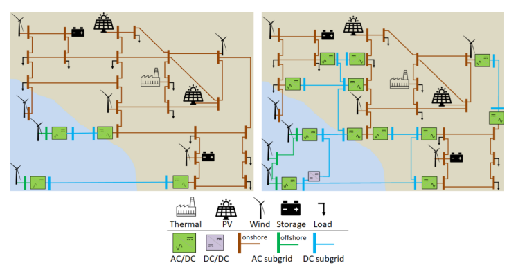

Today we have AC grids with some DC links. In the near future
the DC pieces of the grid will be increasinglymore relevant.

## Modelling AC-DC links (the easy way)

The easy way of modelling HVDC links is by using the 2-generator model.
In VeraGrid this is represented by the `HvdcLine`device.


This is a well known model in the literature, however you cannot represent a
proper DC grid with it, nor you can simulate contingencies on the DC elements 
or have more than one cable at a time.


### Controls available

The `HvdcLine` device has only 2 controls: Active power control (`Pset`) and AC line emulation (`free`)

| Control type | Effect                                                  |
|--------------|---------------------------------------------------------|
| Pset         | Set active power                                        |
| free         | AC emulation:<br/>$P = P_0 + k · (\theta_f - \theta_t)$ |

Let's see a python example using 4 buses:

```python
import VeraGridEngine as vg

# Grid instantiation
grid = vg.MultiCircuit()

# Define buses
bus1 = grid.add_bus(vg.Bus(name='B1', Vnom=135, is_slack=True))
bus2 = grid.add_bus(vg.Bus(name='B2', Vnom=135))
bus5 = grid.add_bus(vg.Bus(name='B5', Vnom=135))
bus6 = grid.add_bus(vg.Bus(name='B6', Vnom=135))

# Define AC lines
line12 = grid.add_line(vg.Line(name='L12', bus_from=bus1, bus_to=bus2, r=0.001, x=0.01))
line25 = grid.add_line(vg.Line(name='L25', bus_from=bus2, bus_to=bus5, r=0.05, x=0.05))
line56 = grid.add_line(vg.Line(name='L56', bus_from=bus5, bus_to=bus6, r=0.001, x=0.01))
line256 = grid.add_line(vg.Line(name='L562', bus_from=bus5, bus_to=bus6, r=0.001, x=0.01))

# Define Hvdc Line
line34 = grid.add_hvdc(vg.HvdcLine(name='L34', bus_from=bus2, bus_to=bus5, Pset=0.2))

# Define generators
grid.add_generator(bus=bus1, api_obj=vg.Generator(name='Gen1', P=1.0, vset=1.01))
grid.add_generator(bus=bus6, api_obj=vg.Generator(name='Gen2', P=1.0, vset=1.02))

# Define loads
grid.add_load(bus=bus2, api_obj=vg.Load(name='Load1', P=3.0, Q=0.3))
grid.add_load(bus=bus5, api_obj=vg.Load(name='Load2', P=2.0, Q=0.5))

# Run power flow
pf_options = vg.PowerFlowOptions(solver_type=vg.SolverType.PowellDogLeg,
                                 retry_with_other_methods=False)
pf_driver = vg.PowerFlowDriver(grid=grid, options=pf_options)
pf_driver.run()

print('Bus values')
print(pf_driver.results.get_bus_df())

print('Branch values')
print(pf_driver.results.get_branch_df())

print("error:", pf_driver.results.error)

vg.save_file(grid, "6bus_a.veragrid")
```

## Modelling AC-DC links (the better way)

A better way of simulating AC-DC grids is what led us to research the literature
for formulations that were complete, correct and explicit. Founding none, we
started to create a formulation, by means of introducing how a converter device should behave. 


It turns out that a converter cannot be a regular $\pi$-branch. 
It has to be a _decoupled_ branch represented by two injections.
More or less like the 2-generators model: 2 injections plus a coupling equation.


By introducing this type of branch, we get the freedom to represent the 
AC and DC grids in any level of detail.


## Solvability rules

The power flow simulation is an optimization problem 
formed by equality constraints. Because of this: 

- For every AC island we must specify one voltage module $Vm$ and one voltage angle $\theta$. 
Usually, at the so called *slack bus*.

- For every DC island there must be a $Vm$ set point. 
This can be thought of as a DC slack.

- An AC branch has 4 unknowns ($Vm_f, Vm_t, \theta_f, \theta_t$) 
and 4 equations ($P_f, P_t, Q_f, Q_t$).

- A DC branch has 2 unknowns ($Vm_f, Vm_t$) and 2 equations 
($P_f, P_t$).

- A converter branch has 3 unknowns ($Vm_f, Vm_t, \theta_t$) 
and only 1 _natural_ equation, the losses equation.
That is why every converter must control two magnitudes to 
add the 2 extra equations needed. 


Since we must ensure equal number of unknowns and equations globally, 
there is a control compatibility theory.

### Controls available

Steaming from the solvability rules, we can introduce the converter controls.
For every converter we need to choose 2 controls to ensure solvability.

| Control type  | Effect                                             |
|---------------|----------------------------------------------------|
| $Vm_{dc}$     | Voltage module control at the DC side (from side)  |
| $Vm_{ac}$     | Voltage module control at the AC side (to side)    |
| $\theta_{ac}$ | Voltage angle control at the AC side (to side)     |
| $P_{ac}$      | Active power control at the AC side (to side)      |
| $Q_{ac}$      | Reactive power control at the AC side (to side)    |
| $P_{dc}$      | Active power control at the DC side (from side)    |


## Putting it all together

We wanted a no-compromise AC-DC power flow with good convergence properties.


This method was introduced in [here](https://upcommons.upc.edu/server/api/core/bitstreams/c522ad67-438a-48c3-aa1b-a03859cd6659/content)
and further developed in VeraGrid from 2024 to 2025.

## 6-bus example

```python
import VeraGridEngine as vg

# Grid instantiation
grid = vg.MultiCircuit()

# Define buses
bus1 = grid.add_bus(vg.Bus(name='B1', Vnom=135, is_slack=True))
bus2 = grid.add_bus(vg.Bus(name='B2', Vnom=135))
bus3 = grid.add_bus(vg.Bus(name='B3', Vnom=100, is_dc=True))
bus4 = grid.add_bus(vg.Bus(name='B4', Vnom=100, is_dc=True))
bus5 = grid.add_bus(vg.Bus(name='B5', Vnom=135))
bus6 = grid.add_bus(vg.Bus(name='B6', Vnom=135))

# Define AC lines
line12 = grid.add_line(vg.Line(name='L12', bus_from=bus1, bus_to=bus2, r=0.001, x=0.1))
line25 = grid.add_line(vg.Line(name='L25', bus_from=bus2, bus_to=bus5, r=1.05, x=0.5))
line56 = grid.add_line(vg.Line(name='L56', bus_from=bus5, bus_to=bus6, r=0.001, x=0.1))
line256 = grid.add_line(vg.Line(name='L562', bus_from=bus5, bus_to=bus6, r=0.001, x=0.1))

# Define DC lines
line34 = grid.add_dc_line(vg.DcLine(name='L34', bus_from=bus3, bus_to=bus4, r=2.05))

# Define VSCs
vsc1 = grid.add_vsc(vg.VSC(name='VSC1', bus_from=bus3, bus_to=bus2, 
                           rate=100, alpha1=0.001, alpha2=0.015, alpha3=0.01,
                           control1=vg.ConverterControlType.Vm_ac, 
                           control2=vg.ConverterControlType.Pdc,
                           control1_val=1.0333, 
                           control2_val=0.2))

vsc2 = grid.add_vsc(vg.VSC(name='VSC2', bus_from=bus4, bus_to=bus5, 
                           rate=100, alpha1=0.001, alpha2=0.015, alpha3=0.01,
                           control1=vg.ConverterControlType.Vm_dc, 
                           control2=vg.ConverterControlType.Qac,
                           control1_val=1.05, 
                           control2_val=-7.21))

# Define generators
grid.add_generator(bus=bus1, api_obj=vg.Generator(name='Gen1', P=1.0, vset=1.01))
grid.add_generator(bus=bus6, api_obj=vg.Generator(name='Gen2', P=1.0, vset=1.02))

# Define loads
grid.add_load(bus=bus2, api_obj=vg.Load(name='Load1', P=3.0, Q=0.3))
grid.add_load(bus=bus5, api_obj=vg.Load(name='Load2', P=2.0, Q=0.5))

# Run power flow
pf_options = vg.PowerFlowOptions(solver_type=vg.SolverType.PowellDogLeg,
                                 retry_with_other_methods=False)
pf_driver = vg.PowerFlowDriver(grid=grid, options=pf_options)
pf_driver.run()

print('Bus values')
print(pf_driver.results.get_bus_df())
print(pf_driver.results.get_bus_df().to_markdown(tablefmt="grid"))

print('Branch values')
print(pf_driver.results.get_branch_df())
print(pf_driver.results.get_branch_df().to_markdown(tablefmt="grid"))

print("error:", pf_driver.results.error)

vg.save_file(grid, "6bus.veragrid")
```


|    |      Vm |        Va |         P |              Q |
|----|---------|-----------|-----------|----------------|
| B1 | 1.01    |  0        | 15.5919   | -236.815       |
| B2 | 1.0333  | -0.215613 | -3        |   -0.299984    |
| B3 | 1.04608 |  0        | -0.197999 |   -9.75607e-22 |
| B4 | 1.05    |  0        |  0.198741 |    9.79262e-22 |
| B5 | 1.02144 |  0.362496 | -2        |   -0.499983    |
| B6 | 1.02    |  0.373325 |  1        |  -29.3828      |


|      |        Pf |             Qf |         Pt |            Qt |   loading |       Ploss |       Qloss |
|------|-----------|----------------|------------|---------------|-----------|-------------|-------------|
| L12  | 15.5919   | -236.815       | -15.0397   | 242.337       | 1559.19   | 0.552148    | 5.52148     |
| L25  |  1.66417  |   22.9626      |  -1.41595  | -22.7143      |  166.417  | 0.248218    | 0.248218    |
| L56  | -0.497924 |   14.7122      |   0.500001 | -14.6914      |  -49.7924 | 0.00207697  | 0.0207697   |
| L562 | -0.497924 |   14.7122      |   0.500001 | -14.6914      |  -49.7924 | 0.00207697  | 0.0207697   |
| L34  | -0.199999 |   -9.75607e-22 |   0.200749 |   9.79262e-22 |  -19.9999 | 0.000749344 | 3.65533e-24 |


## 3120 AC bus + 5 DC bus case

This is the 3120 bus case from the pglib / Matpower case library. 
It has been modified to embed a 5 DC bus network within it.


This is the AC-DC subgrid schematic.

Just load the case from [`data/case3120_5_he.veragrid`](data/case3120_5_he.veragrid) 
into the GUI by drag&drop. The excersise is to:

1. Run a power flow
2. Interpret the power flow results
3. Change the converter controls and control set points and see the effects

### 1. Power Flow

- Click the **Power Flow** icon to start the calculation:  
   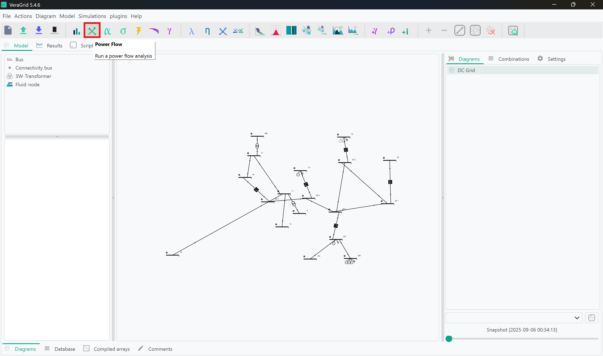
- Once completed, the results can be inspected in two ways:
   - **Directly on the schematic**:  
     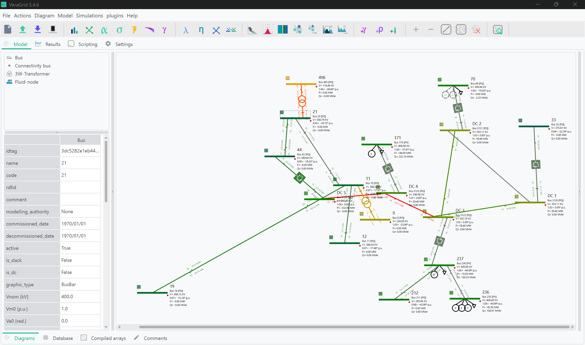
   - **Through the Results tab**, which provides logs and numerical details:  
     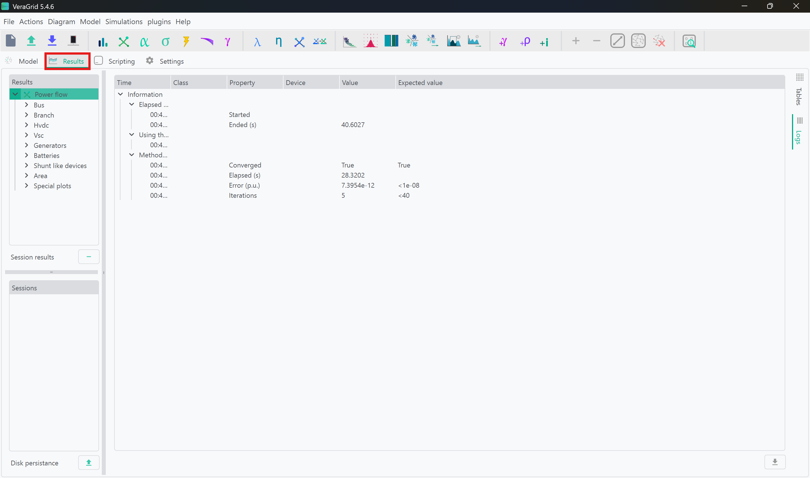

👉 Tip: For a structured overview, click on **Tables** and expand the cascading menu. This gives access to all device data in the grid:  
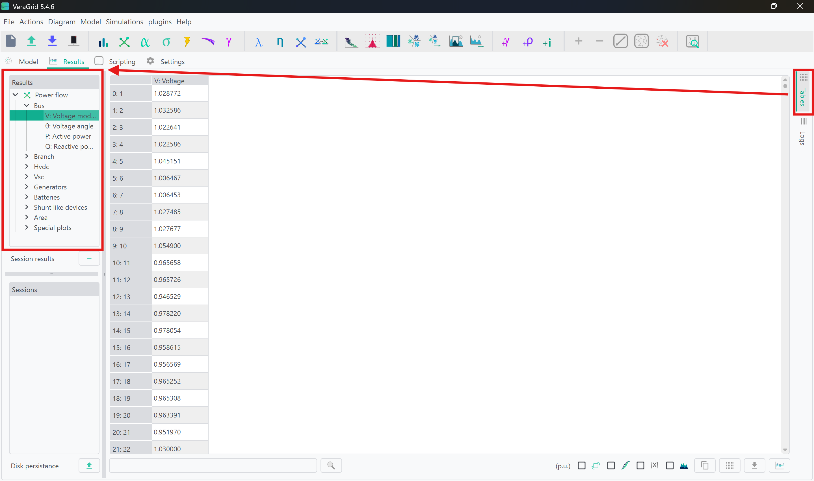

---

### 2. Interpreting Results

- Bus Voltages: Check voltage levels and angle across the grid.
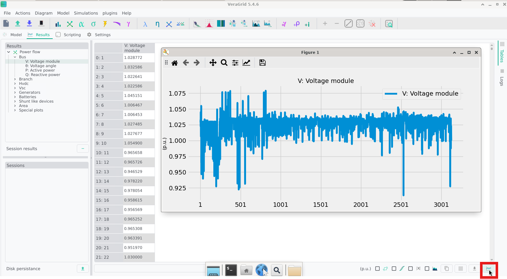
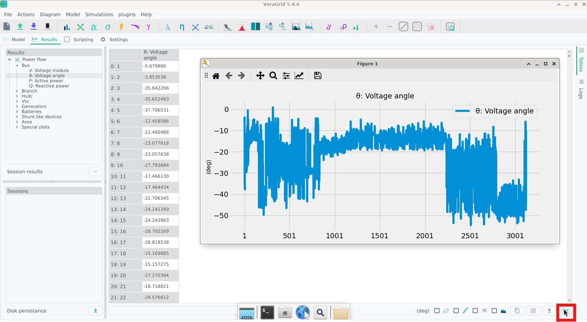
- AC-DC Branch Flows: Analyze power flows through AC and DC branches
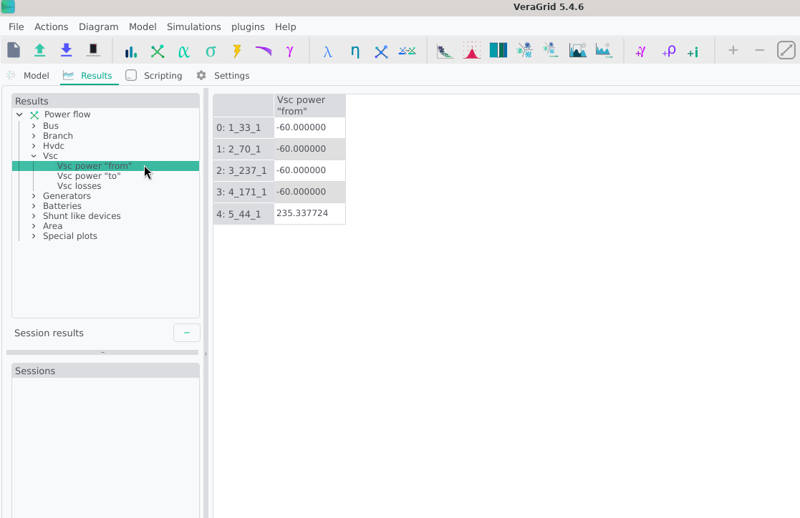
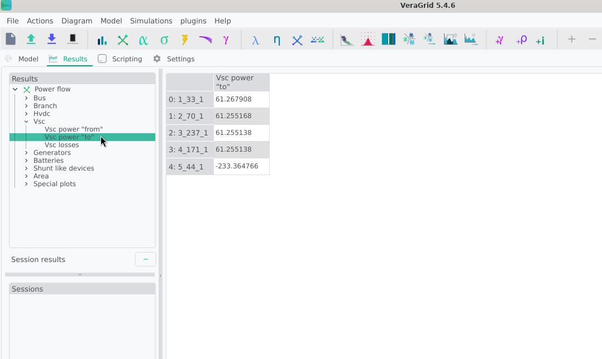
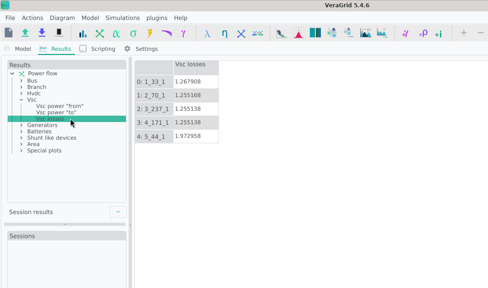
- Once again, we may return to the schematic view for a more intuitive understanding of the results to observe the bus magnitudes and branch flows.


Notice how all except one of the converters are operating at fixed power. The last one is controlling the DC voltage, as is required for solvability. Let's try changing some controls:

### 3. Changing Converter Controls
- In the schematic, click on a converter to open its properties. Here, we focus on VSC interfacing between the DC Bus 2 and AC Bus 70
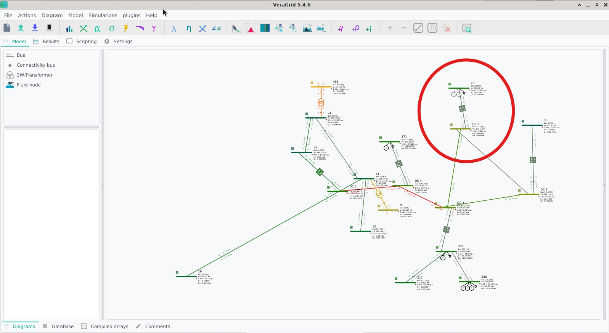
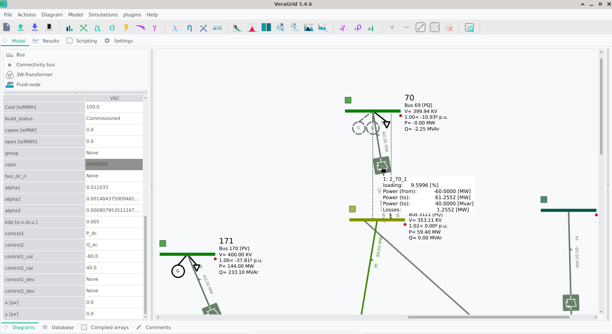
- We can begin with a simple change of direction of the active power flow. Change the `control1` dropdown menu from `Pdc` to `Pac`. Leave the rest as is and click on the Power Flow icon again to re-run the simulation.
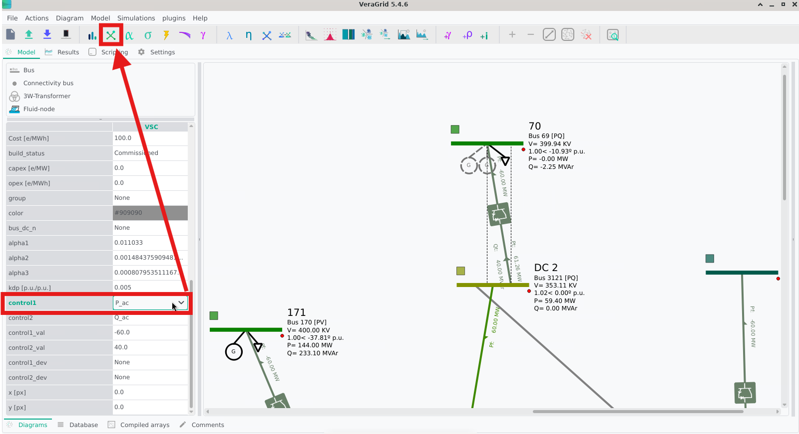
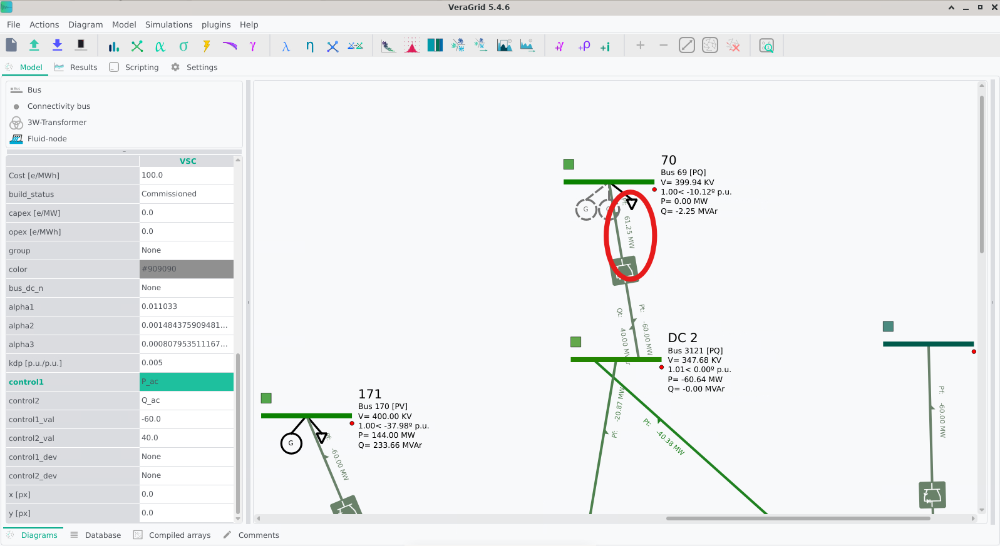
- Notice how the power flow direction has changed, and the DC voltage has adjusted accordingly. If we prefer, we can explicitly set the DC voltage instead of letting it float. Change `control1` to `Vm_dc` and set `control1_val` to `1.01`. Run the power flow again.
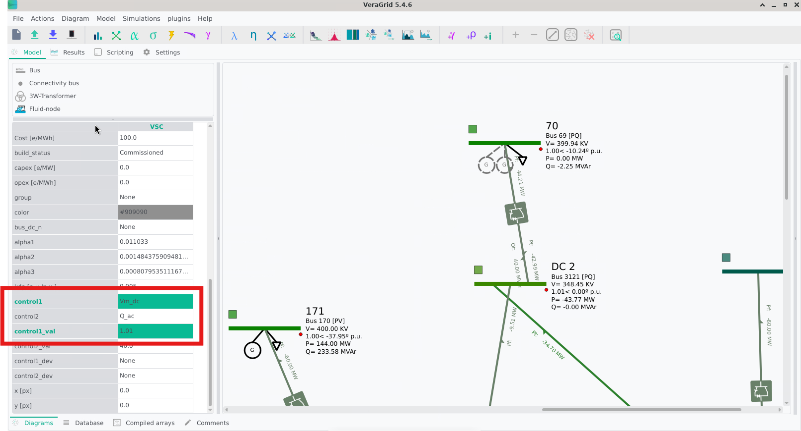